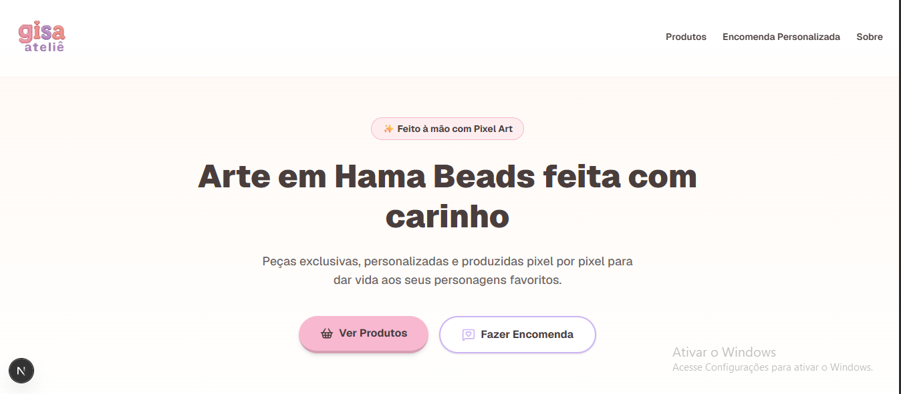
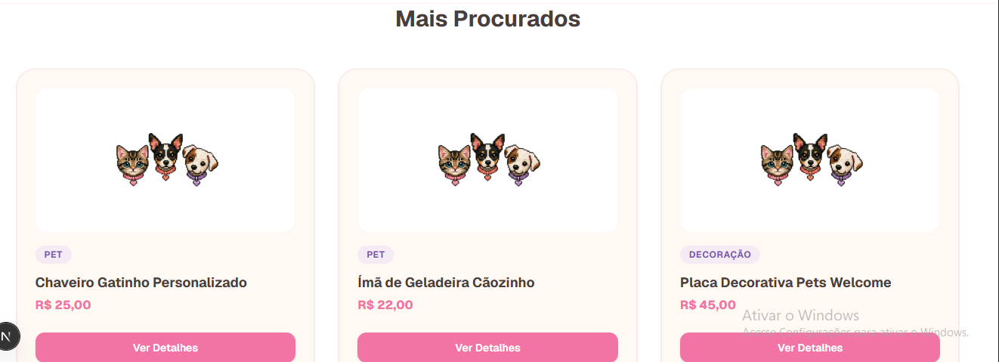
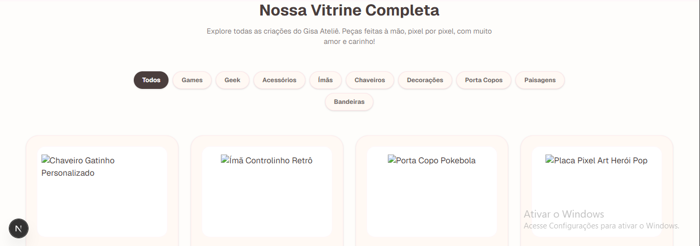
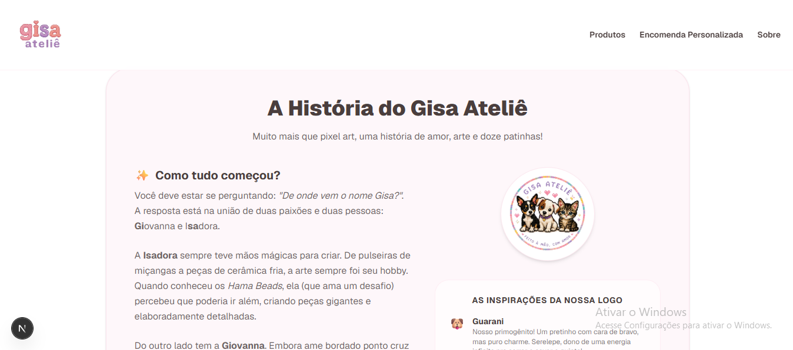
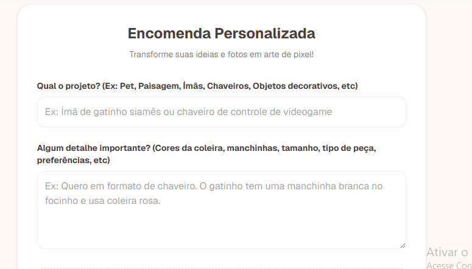

# ✨ Gisa Ateliê ✨
> Pixels que conectam, detalhes que encantam.

Este é o repositório oficial da plataforma web do **Gisa Ateliê**, um projeto desenvolvido com tecnologias modernas de web development para integrar a arte em *Pixel Art (Hama Beads)* com uma experiência digital eficiente de vendas e encomendas personalizadas.

---

## 🖼️ Visão Geral do Projeto
O sistema foi idealizado para ser o canal oficial de vendas da Giovanna e da Isadora. O foco foi unir design responsivo, usabilidade intuitiva e uma estrutura técnica robusta.

### 🏠 Aterrisagem e Hero
A interface foi projetada para conversão imediata, destacando a identidade visual e chamadas de ação claras.


### 🛒 Catálogo e Vitrine
Desenvolvemos uma experiência dinâmica de navegação. Na Home, destacamos os produtos mais procurados; na vitrine completa, o cliente conta com filtros por categoria para encontrar exatamente o que busca.
| Mais Procurados | Vitrine Completa (Filtros) |
| :---: | :---: |
|  |  |

### 📖 Nossa História
A seção "Sobre" não é apenas um texto, é storytelling puro. É onde humanizamos a marca e conectamos os clientes com a trajetória da Gi e da Isa.


### 📝 Encomendas Sob Medida
O formulário de encomenda personalizada permite que o cliente envie detalhes específicos, transformando ideias em projetos de arte concretos através de uma comunicação direta.


---

## 🛠️ Tecnologias e Ferramentas
O projeto foi construído seguindo boas práticas de *Clean Code* e *Performance*:

* **Framework:** Next.js 15 (App Router)
* **Estilização:** CSS
* **Segurança:** Variáveis de ambiente (`.env`)
* **Deploy:** Vercel

---

## 🔐 Configuração de Segurança (Importante)
Para garantir a privacidade dos contatos do Ateliê e evitar spam, os dados sensíveis são gerenciados via variáveis de ambiente. 

**Como configurar seu ambiente:**
1. Crie um arquivo `.env.local` na raiz do projeto.
2. Adicione os campos abaixo (o arquivo `.env.local` já está ignorado pelo Git):

```env
NEXT_PUBLIC_WHATSAPP_NUMBER=SEU_NUMERO_AQUI
NEXT_PUBLIC_INSTAGRAM_URL=URL_DO_INSTAGRAM_AQUI

✨ Funcionalidades Avançadas Implementadas

Navegação Inteligente Inter-Abas: Links configurados com roteamento composto (href="/#encomenda"). Caso o usuário clique no menu a partir de páginas internas como /sobre, o Next.js gerencia o retorno à página principal e realiza o scroll suave automático até a seção desejada.

Imagens com Proteção de Fallback: Todos os componentes de exibição de imagens contam com gatilhos de captura de erro (onError). Caso uma imagem de produto seja removida ou mude de nome, o sistema injeta um placeholder limpo na paleta do site:

TypeScript
  onError={(e) => {
    (e.target as HTMLImageElement).src = '[https://placehold.co/300x300/fff9f4/4a3e3d?text=Foto+Em+Breve](https://placehold.co/300x300/fff9f4/4a3e3d?text=Foto+Em+Breve)';
  }}
Mensagens Pré-Configuradas Dinâmicas: Ao abrir a janela modal de detalhes e optar por encomendar via WhatsApp, o link monta uma string codificada em URL contendo o nome e o valor exato do produto escolhido, otimizando o fluxo de atendimento.

📦 Como Executar o Projeto Localmente

Clone o repositório público:

Bash
   git clone [https://github.com/seu-usuario/gisa-atelie.git](https://github.com/seu-usuario/gisa-atelie.git)
Instale as dependências do projeto:

Bash
   npm install
Configure as credenciais:
Duplique os exemplos de variáveis de ambiente configurando seu arquivo .env.local.

Inicialize o servidor de desenvolvimento:

Bash
   npm run dev
Acesse o ambiente local:
Abra o navegador em http://localhost:3000 e acompanhe as alterações em tempo real.
